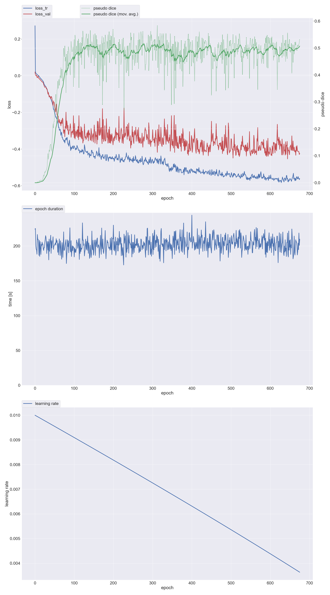
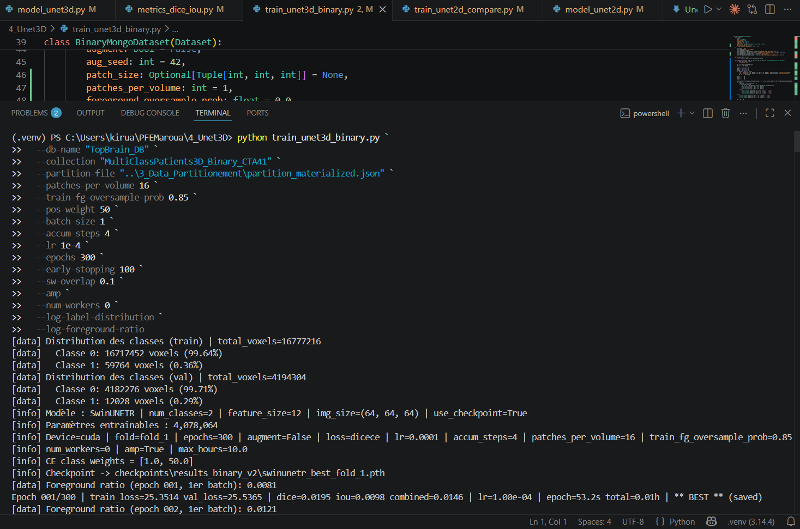
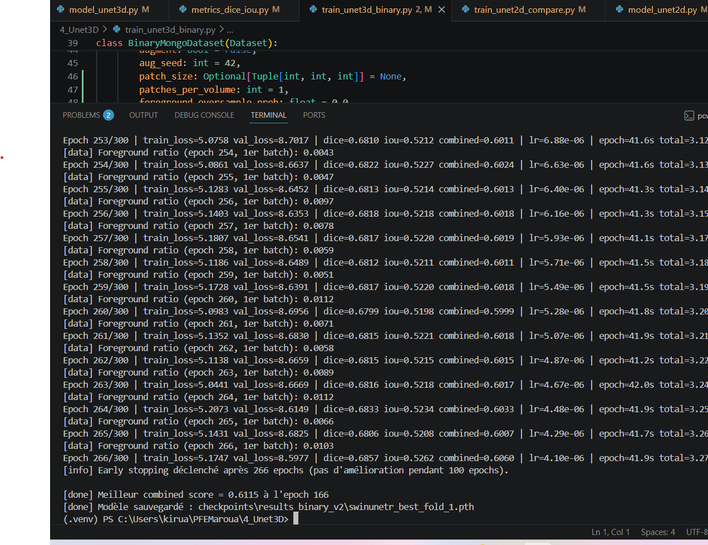

# TopBrain - Hierarchical 3D Brain Vessel Segmentation (CTA)

Research-oriented deep learning pipeline for cerebrovascular segmentation from 3D CTA volumes, designed with reproducibility, staged learning, and clinical interpretability in mind.

## Why This Repo

This repository is organized to demonstrate applied medical AI research skills end-to-end:

- data engineering + quality controls
- hierarchical model design (coarse-to-fine)
- reproducible experiments and diagnostics
- clear reporting of metrics and failure modes

## Problem

Segmenting brain vessels is difficult because of:

- extreme class imbalance (tiny vessels vs large background)
- high anatomical variability across patients
- thin structures and low local contrast

## Method Overview

The project uses a 3-stage hierarchical strategy:

1. Stage 1 (Binary): vessel vs background prior mask.
2. Stage 2 (Level-1 families): 5 classes (BG, CoW, Ant/Mid, Post, Vein).
3. Stage 3 (Level-2 fine): 41 classes with Stage-2 checkpoint initialization.

Model family: SwinUNETR (MONAI/PyTorch), patch-based 3D training with foreground oversampling and DiceCE loss.

## Current Results (Fold 1)

### Stage 1 - Binary (val split, threshold = 0.35)

- Mean recall: 0.8010
- Mean precision: 0.7480
- Mean Dice: 0.7726
- Diagnostic file: [stage1_diagnostic.json](stage1_diagnostic.json)

### Stage 2 - Level-1 Families (5 classes, val split)

- Mean Dice over FG classes: 0.7076
- Mean IoU over FG classes: 0.5626
- Combined score: 0.6351
- Diagnostic file: [results/level1_diag_fold_1.json](results/level1_diag_fold_1.json)

### Stage 3 - Level-2 Fine (41 classes, fold_1)

- Best epoch: 186
- Best `val_dice_fg` (40 FG classes): 0.3979
- Active classes at best epoch: 31
- Checkpoint: [5_HierarchicalSeg/checkpoints/stage3_level2_v1/swinunetr_level2_best_fold_1.pth](5_HierarchicalSeg/checkpoints/stage3_level2_v1/swinunetr_level2_best_fold_1.pth)
- History: [5_HierarchicalSeg/checkpoints/stage3_level2_v1/history_level2_fold_1.json](5_HierarchicalSeg/checkpoints/stage3_level2_v1/history_level2_fold_1.json)

## Visual Outputs

### Training/Progress



### Pipeline Illustration




## Reproducibility

### 1) Environment

```powershell
python -m venv env_gpu
env_gpu\Scripts\activate
pip install -r requirements.txt
```

### 2) Data & DB setup

- Configure MongoDB credentials in `.env` (see `.env.example`).
- Main DB used in experiments: `TopBrain_DB`.

### 3) Training commands

Stage 1:

```powershell
env_gpu/Scripts/python.exe 4_Unet3D/train_unet3d_binary.py --collection "MultiClassPatients3D_Binary_CTA41" --target-size "128x128x64" --partition-file "3_Data_Partitionement/partition_materialized.json" --num-classes 2 --fold fold_1 --epochs 300 --patch-size 64 64 64 --swin-feature-size 24 --batch-size 1 --accum-steps 8 --patches-per-volume 12 --train-fg-oversample-prob 0.90 --loss dicece --lambda-dice 2.0 --lambda-ce 0.5 --class-weights "0.05,1.0" --lr 3e-4 --augment --amp --early-stopping 50 --max-hours 12 --save-dir "4_Unet3D/checkpoints/stage1_binary_v2"
```

Stage 2:

```powershell
env_gpu/Scripts/python.exe 5_HierarchicalSeg/level1_families/train_level1.py --collection "HierarchicalPatients3D_Level1_CTA41" --target-size "128x128x64" --partition-file "3_Data_Partitionement/partition_materialized.json" --num-classes 5 --fold fold_1 --epochs 300 --patch-size 64 64 64 --swin-feature-size 24 --batch-size 1 --accum-steps 8 --patches-per-volume 12 --train-fg-oversample-prob 0.90 --loss dicece --lambda-dice 2.0 --lambda-ce 0.5 --class-weights "0.050,1.388,1.031,0.971,0.527" --lr 3e-4 --augment --amp --early-stopping 50 --max-hours 12 --init-checkpoint "4_Unet3D/checkpoints/stage1_binary_v2/swinunetr_best_fold_1.pth" --log-label-distribution --log-foreground-ratio --save-dir "5_HierarchicalSeg/checkpoints/stage2_level1_v1"
```

Stage 3:

```powershell
env_gpu/Scripts/python.exe 5_HierarchicalSeg/level2_fine/train_level2.py --collection "HierarchicalPatients3D_Level2_CTA41_fold1" --target-size "128x128x64" --partition-file "3_Data_Partitionement/partition_materialized.json" --fold fold_1 --num-classes 41 --epochs 300 --patch-size 64 64 64 --swin-feature-size 24 --batch-size 1 --accum-steps 8 --patches-per-volume 12 --train-fg-oversample-prob 0.90 --loss dicece --lambda-dice 2.0 --lambda-ce 0.5 --auto-class-weights --lr 3e-4 --augment --amp --early-stopping 50 --max-hours 12 --init-checkpoint "5_HierarchicalSeg/checkpoints/stage2_level1_v1/swinunetr_level1_best_fold_1.pth" --save-dir "5_HierarchicalSeg/checkpoints/stage3_level2_v1"
```

## Repository Layout

```text
TopBrain_Project/
|- 1_ETL/                      # Extract/Transform/Load pipeline
|- 2_data_augmentation/        # MONAI-based augmentation utilities
|- 3_Data_Partitionement/      # Fold definitions and split materialization
|- 4_Unet3D/                   # Stage-1 training + core 3D model scripts
|- 5_HierarchicalSeg/
|  |- level1_families/         # Stage-2 family-level segmentation
|  |- level2_fine/             # Stage-3 fine-grained segmentation
|  |- checkpoints/
|- diagnose_stage1_recall.py
|- diagnose_level1_families.py
|- diagnose_level2_fine.py
|- results/                    # Diagnostics and run reports
|- docs/                       # Method notes and experiment documentation
```

## Tech Stack

- Python
- PyTorch
- MONAI
- NumPy / SciPy
- nibabel
- MongoDB + PyMongo
- matplotlib

## Scientific Rigor Notes

- Fixed fold protocol via [3_Data_Partitionement/partition_materialized.json](3_Data_Partitionement/partition_materialized.json)
- Explicit diagnostics scripts for each stage
- Separate evaluation of global foreground performance and clinically relevant classes
- Hierarchical class definition tracked in [class_hierarchy.json](class_hierarchy.json)

## Roadmap

- Run full CV5 on Stage 3 and aggregate confidence intervals
- Improve rare-class sampling and loss reweighting on Level-2
- Add per-class calibration and uncertainty maps
- Package reproducible training/evaluation entry points under `src/`

## Disclaimer

This repository contains research code and experiment artifacts. Dataset access may be restricted depending on licensing and institutional rules.